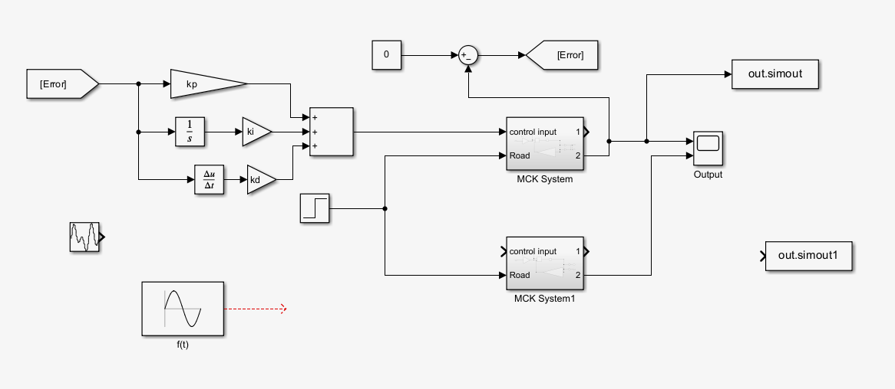
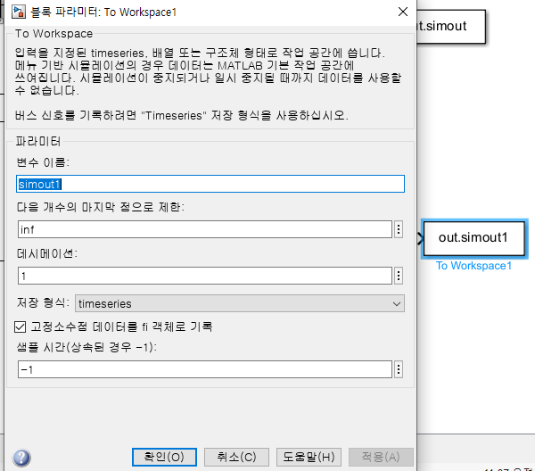
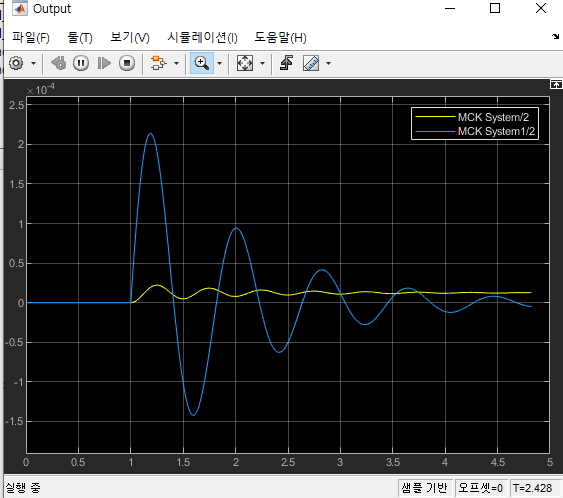

0. 다음과 같은 PID 제어 시스템을 Simulink에서 구성하기 ( MCK System 부분 제어 )



<br/>


1. To workspace 블록 이용하여 Matlab으로 결과값 보내기



<br/>

2. changjun이라는 simulink 파일을 반복문을 이용하여 simulink 결과 데이터를 저장함
    
    rms 값을 계산해서 A행렬에 저장한다
    

```matlab
clc
clear 
ki=1; kd=1;
A=zeros(100);
i=0;

for kp=50000:10000:1000000
    for ki=1:1:100
        for kd=1:1:100
            i=i+1;
            out=sim("changjun.slx");
            A(i,1)=rms(out.simout);
        end
    end
end
```


<br/>

3. Kp,Ki,Kd 값 변경하면서 계속 rms 값 구하고 저장하는 과정을 진행함(좀 오래걸림)



RMS 값 같은 어떤 목표값을 저장하여 저장하고 최적의 목표값을 도출하는 PID 계수를 이용하여 제어기를 설계하면 된다