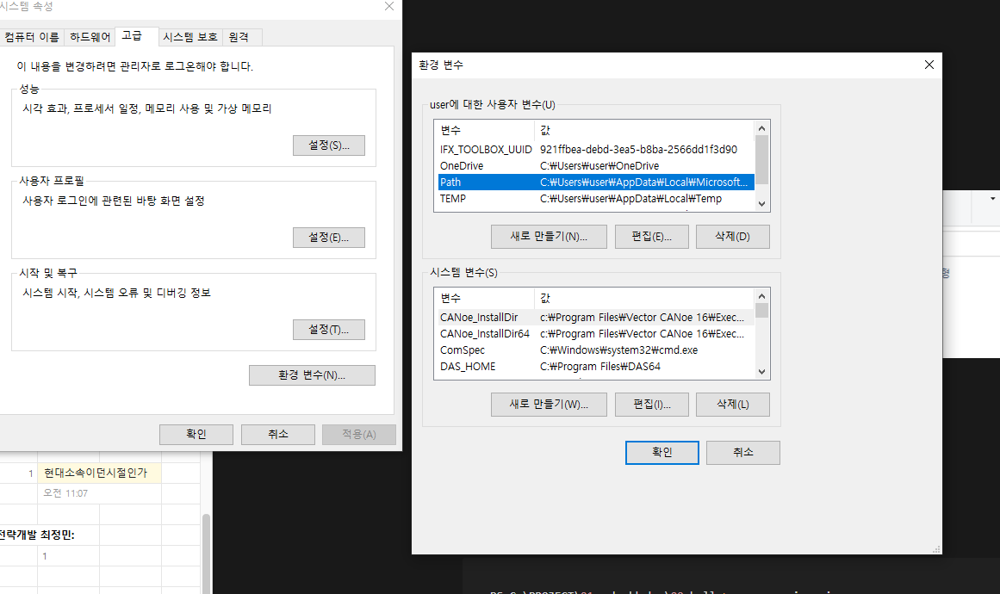
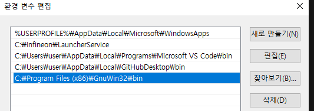
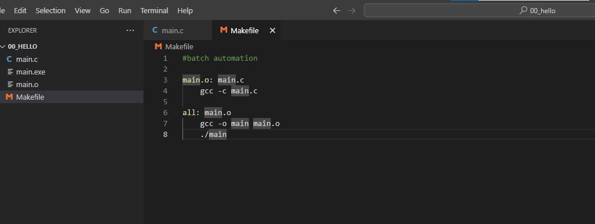
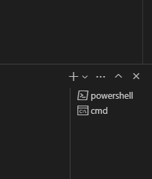
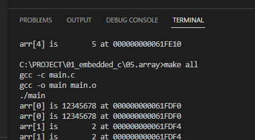
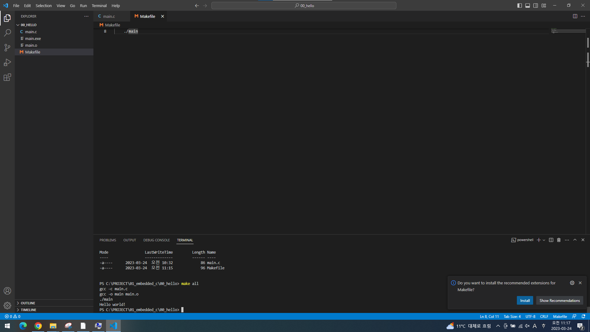

# 임베디드 C프로그래밍 1일차

# VScode 실행하는법

## 1. 설치하기



시작 → 시스템 변수 편집 → 환경변수 → Path → 편집

makefile 설치된 폴더 주소 copy and paste 한다




## 2. CMD 실행하기



이 창에 cmd 입력하면 그 폴더 내에서 파일 열림

cmd에서 code .  입력하면 VScode 열린다

main.c 생성하고 코드 작성하기 후 → ctrl + s 누르고 코드 저장



컴파일 하는법

```cpp
PS C:\PROJECT\01_embedded_c\00_hello> gcc -o main main.c
```

그럼 main.exe 생성됨

다음과 같이 Makefile 생성함 



```cpp
#batch automation

main.o: main.c
	gcc -c main.c

all: main.o
	gcc -o main main.o
	./main
```

밑에 cmd로 열어둠 (default는 powershell로 되어있음)



밑에 명령어에 make all 입력하면 실행됨