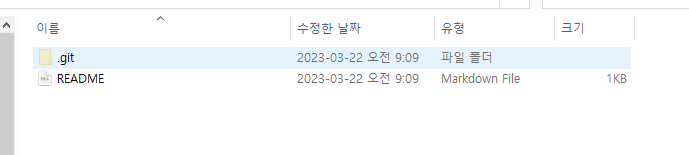
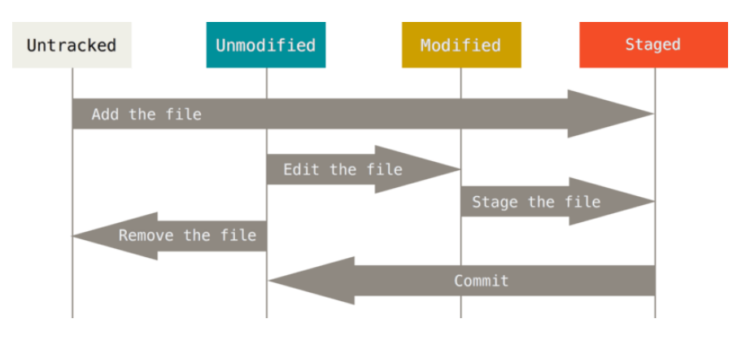
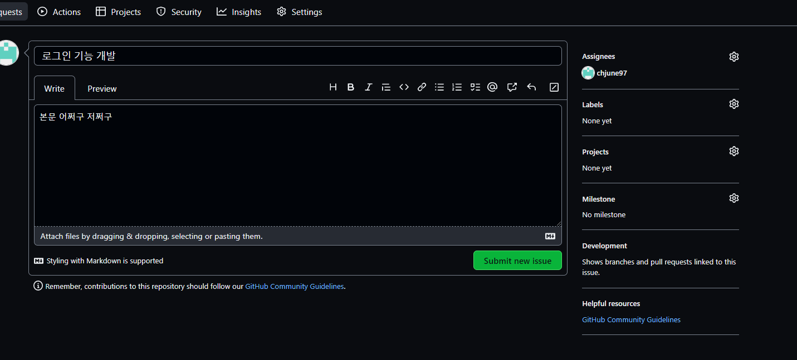
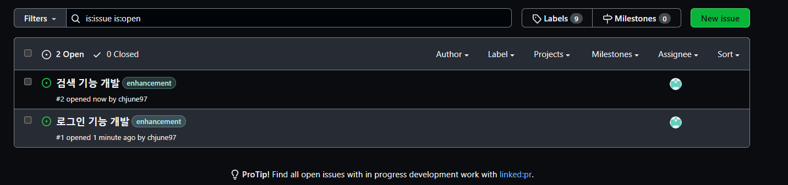
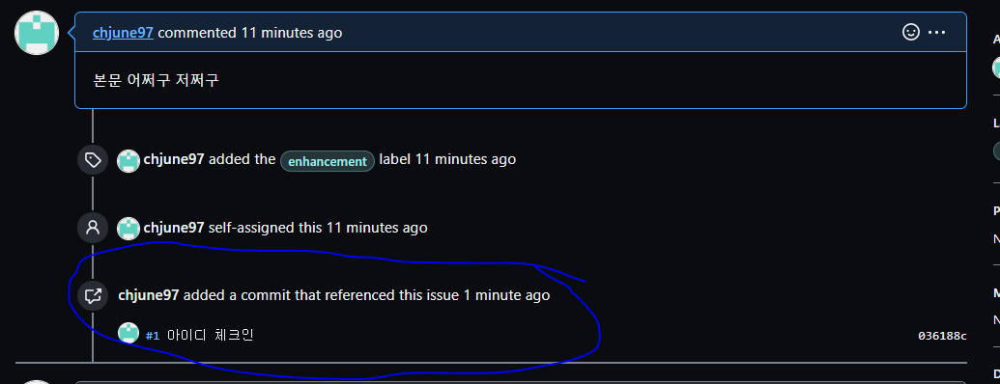
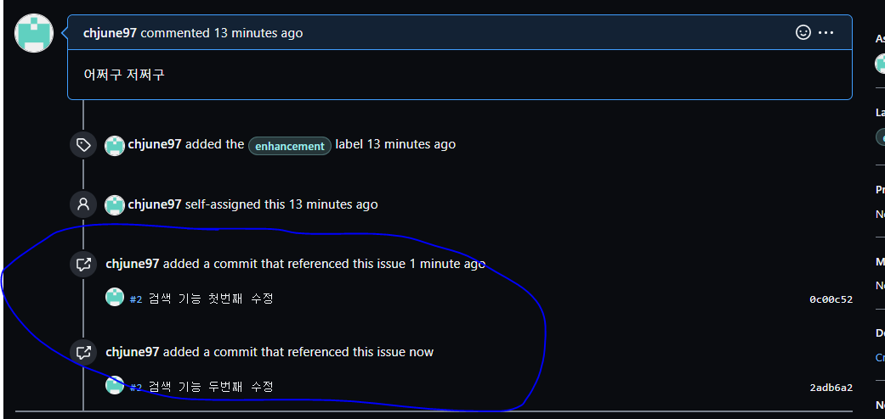

# Git

**svn과의 차별된 Git의 장점**

원격 저장소를 분산하여 clone 할 경우
시작 verson 부터 최신 version 까지 다 갖고있음


<br/>


# Git 단어 정리

**Commit :** 로컬 저장소에 변경사항을 등록하는 것

**Push :** 로컬 저장소에 Commit 된 사항을 원격 저장소인 Repository에 올리는 것

**Pull :** 다른 사람이 원격 저장소 Repository에 올린 Commit을 내 로컬 저장소에 가져오는 것

**토큰 생성**

- 보통 노트북 별로 토큰 만든다
- 권한은 “Repo” 만 체크해도 됨

**Clone**

파일 → 보기→ 숨긴항목 보이기 하면 .git 폴더 보인다



<br/>


**git 상태**



Unmodified : 서버에 있는 버전과 local 버전이 같은 버전

Modified : Local에 서버에서 있는 버전에서 수정된 파일이 저장됨

Untracked : git에 추적되지 않은 파일 ( Local에서 새로 생성한 파일 ) 

Staged : Commit 하려는 파일들을 모음 → add명령어 이용

<br/>


**CMD 창에서 git 명렁어 이용하여 버전관리**

**순서**

1. clone 할 폴더 cd 명령어로 이용
2. repository 주소 clone 하면 폴더에 repository 데이터가 Local에 저장됨
3. Local 에 저장된 데이터를 사용자가 코딩하여 업데이트 함
4. git add 파일이름
    - stage에 업데이트된 파일을 올림
5. git commit -m “ commit comment “
    - Commit 진행
6. git push
- commit한 데이터를 repository에 올림

```cpp
Microsoft Windows [Version 10.0.19045.2486]
(c) Microsoft Corporation. All rights reserved.

C:\Users\user>d:
장치가 준비되지 않았습니다.

C:\Users\user>E:

E:\>git clone https://github.com/chjune97/20230321.git
Cloning into '20230321'...
remote: Enumerating objects: 3, done.
remote: Counting objects: 100% (3/3), done.
remote: Total 3 (delta 0), reused 0 (delta 0), pack-reused 0
Receiving objects: 100% (3/3), done.

E:\>cd 20230321

E:\20230321>dir
 E 드라이브의 볼륨: Data
 볼륨 일련 번호: 4213-2A2F

 E:\20230321 디렉터리

2023-03-22  오전 09:15    <DIR>          .
2023-03-22  오전 09:15    <DIR>          ..
2023-03-22  오전 09:15                65 README.md
               1개 파일                  65 바이트
               2개 디렉터리  476,759,949,312 바이트 남음

```

```cpp
E:\20230321>git status
On branch main
Your branch is up to date with 'origin/main'.

Changes not staged for commit:
  (use "git add <file>..." to update what will be committed)
  (use "git restore <file>..." to discard changes in working directory)
        modified:   README.md

Untracked files:
  (use "git add <file>..." to include in what will be committed)
        aaa.txt.txt

no changes added to commit (use "git add" and/or "git commit -a")
```


<br/>


aaa.txt 파일 업데이트 함

```cpp
E:\20230321>git add README.md

E:\20230321>git status
On branch main
Your branch is up to date with 'origin/main'.

Changes to be committed:
  (use "git restore --staged <file>..." to unstage)
        modified:   README.md

Untracked files:
  (use "git add <file>..." to include in what will be committed)
        aaa.txt

E:\20230321>git add aaa.txt

E:\20230321>git status
On branch main
Your branch is up to date with 'origin/main'.

Changes to be committed:
  (use "git restore --staged <file>..." to unstage)
        modified:   README.md
        new file:   aaa.txt

```

```cpp
E:\20230321>git commit -m "Readme 최초 변경"
[main 7ae8724] Readme 최초 변경
 2 files changed, 8 insertions(+)
 create mode 100644 aaa.txt

```

```cpp
E:\20230321>git push
Enumerating objects: 6, done.
Counting objects: 100% (6/6), done.
Delta compression using up to 4 threads
Compressing objects: 100% (3/3), done.
Writing objects: 100% (4/4), 394 bytes | 394.00 KiB/s, done.
Total 4 (delta 0), reused 0 (delta 0), pack-reused 0
To https://github.com/chjune97/20230321.git
   a1bcbb1..7ae8724  main -> main
```

```cpp
E:\20230321>git pull
Already up to date.
```

```cpp
E:\20230321>git status
On branch main
Your branch is up to date with 'origin/main'.

Changes not staged for commit:
  (use "git add <file>..." to update what will be committed)
  (use "git restore <file>..." to discard changes in working directory)
        modified:   README.md

no changes added to commit (use "git add" and/or "git commit -a")
```

<br/>


# Issue

활동 내역 정리 ( 기존 기능의 개발, 내부 수정 …. )

commit한 근거 issue 관리 시스템에 있어야 함

assignes 나로 함





<br/>


commit할때 Issue랑 연동해서 하면 좋음

```cpp
E:\20230321>git commit -m "#1 아이디 체크인"
[main 036188c] #1 아이디 체크인
```


<br/>


commit할때 “ #숫자 “ 를 맨 앞에 붙이면 숫자 번째에 해당하는 Issue랑 연동 가능!






<br/>


이렇게 commit 메세지 앞에 “#숫자” 를 붙이면 Issue와 연동됨


<br/>


**깃 꿀팁**

- 커밋 여러번 하고 push 한번 하면 커밋 히스토리 여러개 한번에 올라감
- git add . 하면 폴더에 모든 파일 stage에 올라감
- git commit . -m “commit message” 하면 stage에 있는 모든 파일 올라감